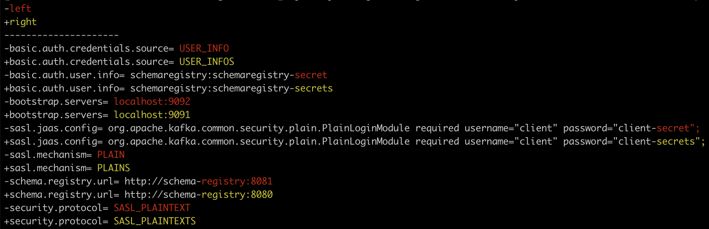

# config-diff-tool

A simple configuration file diff tool.

# Support Config File Formats

* YAML (*.yml, *.yaml)
* JSON (*.json)
* INI (*.ini)
* Properties (*.properties, *.props, *.prop)

# Usage

**Basic Usage**
```
$> java -jar target/config-diff-tool-0.0.1.jar -l client.properties -r client2.properties
```

**Sample Output**



**Help Output**

```
usage: ConfigDiffTool
 -h,--help          Print Help
 -l,--left <arg>    Comma Seperated of configs on the left side of the
                    diff
 -o,--out <arg>     Output File to write to
 -r,--right <arg>   Comma Seperated of configs on the right side of the
                    diff
```